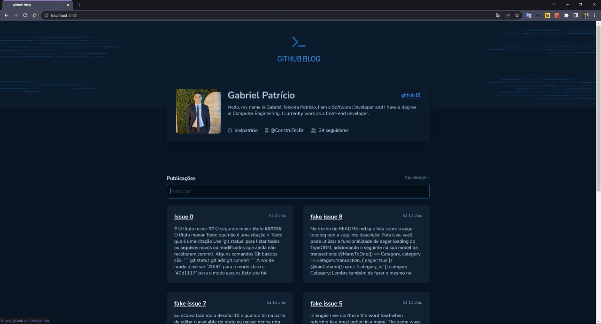
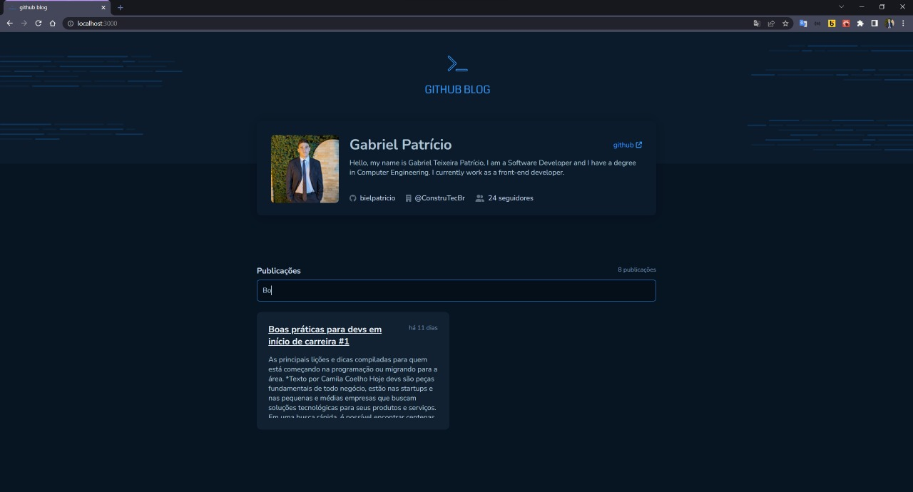
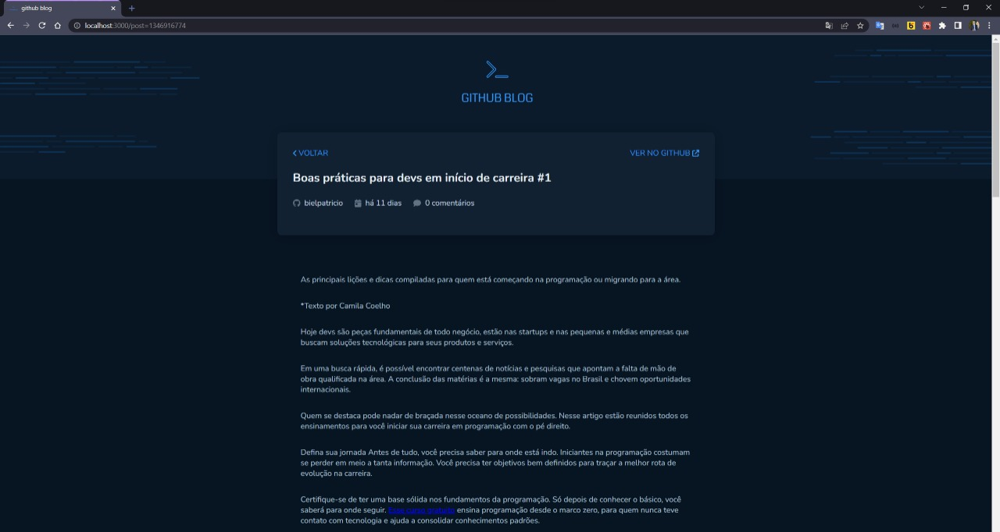

<div id="top"></div>

<!-- PROJECT LOGO -->

<br />
<div align="center">
  
  <h1 align="center">Github Blog</h3>
</div>

<!-- TABLE OF CONTENTS -->

## Contents

<p align="center">
    <p><a href="#about-the-project" title=" go to About the Project">About The Project</a></p>
    <p><a href="#Layout" title=" go to Layout">Layout</a></p>
    <p><a href="#Running locally" title=" go to Running locally">Running locally</a></p>
    <p><a href="#contact" title=" go to Contact">Contact</a></p>
  </p>

<br>
<!-- ABOUT THE PROJECT -->

# About The Project

Challenger project from Ignite ReactJS 2022. To better understand the operation of API and Performance. In this project was used a GitHub API ([GitHub Users API](https://docs.github.com/pt/rest/users/users#get-a-user), [GitHub Search API](https://docs.github.com/pt/rest/search) and [GitHub Issues API](https://docs.github.com/pt/rest/issues/issues#get-an-issue)). To check how use this API you just need click [here](https://docs.github.com/pt/rest/guides/getting-started-with-the-rest-api).

<br>

# Layout

The application layout is available on Figma:

<a href="https://www.figma.com/file/vmYojvguCSv0vkX1GmcWqf/GitHub-Blog-(Community)?node-id=0%3A1">
  
</a>

<br>

<p align="center" style="display: flex; align-items: flex-start; justify-content: center;">
  


<p align="center" style="display: flex; align-items: flex-start; justify-content: center;">
  


<p align="center" style="display: flex; align-items: flex-start; justify-content: center;">
  


<p align="center" style="display: flex; align-items: flex-start; justify-content: center;">
  


</p>

<br>

# Running locally

```bash
# Clone this repository
$ git clone https://github.com/bielpatricio/githubBlog.git
# Access the project folder in your terminal
$ cd githubBlog
# Install the dependencies
$ yarn
# Run the application in development mode
$ yarn dev
# The application will open on the port: 3000 - go to http://localhost:3000
```

<br>

# Contact

Gabriel Patrício - gabrieltp087@gmail.com - [https://github.com/bielpatricio/](https://github.com/bielpatricio)

<p align="right">(<a href="#top">back to top</a>)</p>
